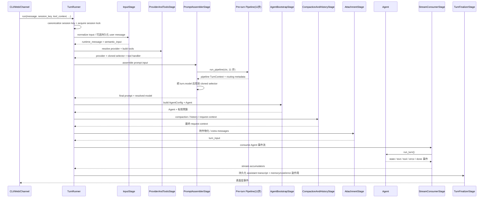

# 第 1 章：架构总览

> **本章目标**：读完这一章，你应该能在脑子里跑一遍 OpenSquilla 后端的可执行心智模型——一次用户请求从哪里进来、由谁编排、在哪一层选模型、最后怎么把结果写回会话。本章只描述当前源码里**已经存在**的边界和调用关系；凡"为什么这样设计"的解释，都会明确标成解释，不伪装成已实现的协议。
>
> 本章是全书的风格样板。每个关键函数都会**完整贴出原始代码**（不省略、不截断），紧跟 `► 注解` 逐行/逐段讲，再配**设计动机**与**真实数据样例**。后面 02–14 章沿用同一套格式。

---

## 1.1 先建立四个第一性概念

OpenSquilla 的术语非常容易混淆。把下面四个概念钉死，后面所有章节都用它们。

| 概念 | 一句话定义 | 生命周期范围 |
|---|---|---|
| **request** | 入口层（CLI / Web RPC / IM 渠道）收到的一次调用，可能含文本、附件、会话键、运行参数 | 从入口适配器到 `TurnRunner.run()` |
| **turn** | Agent 针对一次用户输入完成的**一次完整运行**；可含多次 provider 调用和多次工具调用 | 从 `TurnRunner._run_turn()` 开始，到 `TurnFinalizerStage` 完成 |
| **iteration** | Agent 循环里的一轮"调用 provider → 拿到文本/工具调用 → 必要时执行工具" | 一个 turn 内可以有**多轮** |
| **tool call** | provider 在一次响应里要求执行的一个具体工具调用 | 一个 iteration 内可以有**多个** |

这四个词的嵌套关系是：`request ⊃ turn ⊃ iteration ⊃ tool_call`。

**为什么必须分清这四个词？** 因为 OpenSquilla 最响亮的卖点——"每 turn 路由到最便宜的能处理的模型"——里的"每 turn"**不等于**"每次 HTTP 请求只调一次模型"。一次 turn 里完全可能发生这样的调用序列：

```text
request（CLI 按下回车）
  └─ turn
      ├─ iteration 1: provider.chat → tool_call(read_file) → 工具结果
      ├─ iteration 2: provider.chat → tool_call(run_tests)  → 工具结果
      └─ iteration 3: provider.chat → 最终文本答案
```

`SquillaRouter`（第 3 章）选的是这个 turn 的**初始模型/tier**；Agent 的工具循环（第 2 章）负责在同一个 turn 内继续干活。provider 侧的重试、预算门控、上下文压缩、特殊恢复路径，都可能让实际调用次数继续增加。

### 1.1.1 顺带首讲三个反复出现的词

下面三个词在全书会反复出现，这里第一次讲透：

**canonicalize_session_key（规范化会话键）**

源码：`src/opensquilla/session/keys.py:70-84`

```python
def canonicalize_session_key(session_key: str | None) -> str:
    """Normalize legacy session-key aliases without changing conversation scope."""
    key = str(session_key or "").strip()
    if not key:
        return ""
    if key == "webchat:default":
        return build_webchat_key()
    if key.startswith("subagent:agent:"):
        return f"subagent:{canonicalize_session_key(key[len('subagent:') :])}"
    if key.startswith("agent:"):
        parts = key.split(":")
        if len(parts) >= 2:
            parts[1] = normalize_agent_id(parts[1])
            return ":".join(parts)
    return key
```

► **注解**
- 会话键（session_key）是 OpenSquilla 里**几乎所有状态的隔离键**：会话历史、session lock、memory source、routing history、transcript 都靠它区分。如果同一个用户用两个写法不同的字符串进来，锁和历史就会被拆成两个会话。
- 这个函数不改变对话范围（注释明说 `without changing conversation scope`），只把历史遗留别名（如 `webchat:default`）和大小写不规范的 `agent:xxx:` 统一成一个 canonical 形式。
- `subagent:agent:` 这种嵌套会**递归**规范化内部部分，保证子 Agent 会话键也走同一套规则。

**surface_kind（入口类型）**

源码里它出现在 pipeline `TurnContext` 上：`src/opensquilla/engine/pipeline.py:37` —— 注释写得很直白：

```python
    surface_kind: str = "unknown"  # "web" | "cli" | "channel:<adapter>" | "unknown"
```

它告诉下游"这次输入是从哪个表面进来的"。为什么需要它？因为同一个 clarify（澄清）解析器在面对 Web、CLI、IM 渠道时要**容忍度不同**——IM 渠道的消息可能被网关截断、带 markdown 残留、或用户用手机随手打字。注释 `:34-36` 点明了这是为 PR4 的 clarify reply parser 服务的：

```python
    # PR3 (design §14): surface origin so PR4's clarify reply parser
    # can adapt its tolerance per surface. Defaults to "unknown" so
    # the gateway/CLI/channel adapters can set it post-construction.
```

**run_kind（运行类型）**

在 `run()` 签名里默认是 `"default"`：`src/opensquilla/engine/runtime.py:2719`。常见的值除了 `default` 还有 `heartbeat`（心跳触发的 turn，`:1240` 会专门处理 `run_kind != "heartbeat"` 分支）。它影响的是 transcript 持久化、finalizer 收尾逻辑等，**不影响** turn 的核心执行骨架。

### 1.1.2 真实数据样例：一次 turn 内多 iteration 的消息演化

下面是一次"读文件 → 跑测试 → 回答"的真实消息序列演化（为了讲清 iteration 概念而构造的样例，字段名对应源码里的 `Message` 结构）：

```json
// iteration 1 开始前，Agent 历史里只有系统提示和用户消息
[
  {"role": "system",    "content": "<identity prompt>"},
  {"role": "user",      "content": "检查 report.md 的语法错误，并告诉我第几行要改。"}
]

// iteration 1 结束：provider 返回一个 tool_call，Agent 执行后追加两条消息
[
  {"role": "system",    "content": "<identity prompt>"},
  {"role": "user",      "content": "检查 report.md 的语法错误，并告诉我第几行要改。"},
  {"role": "assistant", "tool_calls": [{"id": "call_1", "name": "read_file",
                                         "arguments": {"path": "report.md"}}]},
  {"role": "tool",      "tool_call_id": "call_1", "content": "<文件第1-80行内容>"}
]

// iteration 2 结束：provider 又返回一个 tool_call（跑测试）
[ ... 上面4条 ...,
  {"role": "assistant", "tool_calls": [{"id": "call_2", "name": "run_command",
                                         "arguments": {"cmd": "npx markdownlint report.md"}}]},
  {"role": "tool",      "tool_call_id": "call_2", "content": "report.md:12: MD009 ..."}
]

// iteration 3 结束：provider 返回最终文本，没有 tool_call → turn 收尾
[ ... 上面6条 ...,
  {"role": "assistant", "content": "第 12 行尾部多了两个空格（MD009），删掉即可。"}
]
```

注意三件事：
1. 一次 turn = 三次 `provider.chat()` 调用，但 router 只在 turn 开始时选了一次模型。
2. 工具调用和工具结果是**成对**追加进历史的；第 2 章会讲 `repair_tool_pairing` 专门保证这种配对不被破坏。
3. 最终文本和中间文本的区分（answer vs intermediate）由 `issue #358` 的策略决定（详见 2.x 节，本章只点一下）。

---

## 1.2 一句话定位与"微内核"的真实含义

OpenSquilla 可以用一句话概括：

> 一个以 `TurnRunner` 为编排边界、以 `Agent._turn_generator` 为执行循环、以 provider/tool/session 等端口为外围能力的**本地 Agent 运行时**。

**"微内核"在这里是职责边界，不是"核心代码很少"。** 这点必须讲清，否则会被误导。当前的 `Agent`（`engine/agent.py`，约 13000+ 行）和 `runtime.py`（约 7700+ 行）都是**大型实现文件**。微内核指的是：核心循环**不应该直接承载所有外围基础设施**；外围能力（路由、工具、沙箱、记忆、渠道、MCP、技能）通过配置、适配器、阶段（stage）和注册表（registry）接入，而不是硬编码进 Agent 类。

当前能从源码确认的核心职责只有**三类**：

1. **Turn 编排**：`TurnRunner` 串起输入、provider/tool 准备、提示词组装、Agent 构建、历史压缩、附件、流消费、收尾。
2. **Agent 执行**：`Agent._turn_generator` 驱动 provider 与工具之间的循环，发出 state / text / tool / error / done 事件。
3. **决策注入**：pre-turn pipeline 修改本 turn 的上下文；其中 `apply_squilla_router` 负责把路由结果写进局部 turn 配置。

记忆、沙箱、渠道、MCP、技能这些**不是**"被 Agent 类直接硬编码的一组内核状态"。它们通过 `TurnRunner` 的适配器、`ToolContext`、provider 接口、session manager 或入口适配器进入执行链。

> **设计动机（解释）**：为什么选"显式代码编排"而不是"图编排框架"？这是全书贯穿的一个权衡。简短回答是：OpenSquilla 想让一次 turn 的全部行为都能**沿着源码调用顺序读出来**，排查问题时不用先理解一个抽象的 graph runtime。1.10 节会给出与 LangGraph / AutoGen 的详细对比。

---

## 1.3 从入口到结果：真实调用链

### 1.3.1 三个入口都收敛到同一个 turn 运行时

CLI、Web/RPC、channel（IM 渠道）三个入口，最终都要把工作交给 turn 运行时。但**收敛之前**它们各自做协议适配、身份解析、附件解析、权限处理、流式输出映射。所以"三个入口共用一个 turn loop"的准确说法是：

```text
入口协议适配
    -> TurnRunner.run(message, session_key, tool_context, ...)
        -> TurnRunner._run_turn(...)
            -> Agent._turn_generator(...)
```

入口**不应该**各自复制 provider 调用和工具循环；但入口**可以保留**协议特有的认证、序列化、断线重连、输出渲染逻辑。

### 1.3.2 一个必须指出的源码事实：docstring 与实际顺序不一致

`run()` 方法有一个 docstring，写的是概念性的步骤顺序。源码：`src/opensquilla/engine/runtime.py:2730-2740`

```python
        """Run one agent turn with full orchestration.

        Acquires per-session lock, then:
        1. Resolve provider (cloned selector — no shared state mutation)
        2. Build tools + handler from registry (filtered by tool_context)
        3. Assemble identity system prompt
        4. Run pre-turn pipeline (model routing, squilla router, skills, prompt cache)
        5. Load session history
        6. Construct and run Agent
        7. Persist assistant response to transcript
        """
```

► **注解**：这个 docstring 是**概念顺序**，不是 `_run_turn()` 里的**实际执行顺序**。读源码时要以 `_run_turn()` 的真实调用为准。`_run_turn()` 里的真实顺序是下面这样（行号都是当前源码实测值）：

| 步骤 | stage | 当前源码行号 |
|---|---|---|
| 0 | 发出 `turn_start` trace 事件 | `runtime.py`（_run_turn 开头） |
| 1 | `InputStage` | `runtime.py:2921` |
| 2 | `ProviderAndToolsStage` | `runtime.py:2938` |
| 3 | `PromptAssemblerStage`（含 11 步 pre-turn pipeline） | `runtime.py:2979` |
| 4 | `AgentBootstrapStage` | `runtime.py:3082` |
| 5 | `CompactionAndHistoryStage` | `runtime.py:3150` |
| 6 | `AttachmentStage` | `runtime.py:3178` |
| 7 | `StreamConsumerStage`（内部调 `Agent.run_turn()`） | `runtime.py:3231` |
| 8 | `TurnFinalizerStage` | `runtime.py:3292` |

对比 docstring 和实际顺序，有两个关键差异：
- docstring 把 "Load session history（5）" 写在 "Construct Agent（6）" 前面；实际代码里 `CompactionAndHistoryStage`（历史）在 `AgentBootstrapStage`（构造 Agent）**之后**。原因是：AgentConfig 里有 context window、model capabilities、compaction 配置，必须先 bootstrap 才能确定压缩策略——这是**数据依赖**，不是编排偏好。
- docstring 没提 `AttachmentStage`，但它在历史之后、流消费之前是独立一步。

### 1.3.3 全局时序图



这里有两个容易被旧文档掩盖的事实：
- **pre-turn pipeline 是由 `PromptAssemblerStage` 调起的**，不是一个和所有 TurnRunner stage 并列、独立发生的外层步骤。
- **stage 文件的命名顺序 ≠ 运行顺序**。按文件名自然语言读（Input → Attachment → Compaction → Provider...）会读错；必须以 `_run_turn()` 的调用顺序为准。

---

## 1.4 TurnRunner.run()：完整代码逐行注解

这是全书最重要的入口函数之一。下面**完整贴出**，不省略任何分支。

源码位置：`src/opensquilla/engine/runtime.py:2697-2842`

### 第一段：函数签名 + 身份规范化 + 派生 ToolContext（2697-2753）

```python
    async def run(
        self,
        message: str,
        session_key: str,
        tool_context: ToolContext,
        agent_id: str = "main",
        model: str | None = None,
        attachments: list[dict] | None = None,
        timeout: float | None = None,
        max_iterations: int | None = None,
        iteration_timeout: float | None = None,
        tool_timeout: float | None = None,
        request_timeout: float | None = None,
        max_provider_retries: int | None = None,
        length_capped_continuations: int | None = None,
        input_mode: str = "user",
        persist_input: bool = False,
        input_provenance: dict[str, Any] | str | None = None,
        history_has_persisted_user: bool = True,
        fresh_user_session: bool | None = None,
        session_intent: str | None = None,
        semantic_message: str | None = None,
        run_kind: str = "default",
        heartbeat_ack_max_chars: int = 300,
        bootstrap_context_mode: str | None = None,
        no_memory_capture: bool = False,
        ingress_pipeline_steps: list[PipelineStepRecord] | None = None,
        router_control_replay_depth: int = 0,
        *,
        pending_input_provider: PendingInputProvider | None = None,
        bound_user_message_id: str | None = None,
        assistant_message_sink: Callable[[str | None, str], None] | None = None,
    ) -> AsyncIterator[AgentEvent]:
```

► **注解（按参数组）**

| 参数组 | 参数 | 为什么不能省 |
|---|---|---|
| **身份** | `session_key`、`agent_id` | 决定会话、工作区、记忆、日志归属 |
| **内容** | `message`、`semantic_message`、`attachments` | `message` 是用户可见运行文本；`semantic_message` 是供路由/relevance 判断的语义文本；二者**不一定相同** |
| **工具** | `tool_context` | 工具不能只拿函数名，还需要 workspace、权限、审批、session、预算上下文 |
| **运行控制** | `timeout`/`max_iterations`/`iteration_timeout`/`tool_timeout`/`request_timeout`/`max_provider_retries` | 覆盖本次运行的有效 AgentConfig（1.8 节详讲预算四维度） |
| **输入控制** | `input_mode`/`persist_input`/`input_provenance`/`history_has_persisted_user` | 决定 user message 是否由本次 turn 负责持久化；replay 路径会传 `persist_input=False` 避免重复写入 |
| **路由控制** | `router_control_replay_depth` | router-control 工具改变 hold 后可能触发重跑，必须带深度防递归 |

继续，函数体开始：

```python
        session_key = canonicalize_session_key(session_key)
        agent_id = normalize_agent_id(agent_id)
        normalized_input_provenance = self._normalize_input_provenance(input_provenance)
        lock = self.get_session_lock(session_key)
        effective_tool_context = replace(
            tool_context,
            session_key=session_key,
            tool_run_budget_key=f"{session_key}:{uuid.uuid4().hex}",
            router_control_config=getattr(self._config, "squilla_router", None),
            router_control_hold_store=self._router_control_hold_store,
            router_control_replay_depth=router_control_replay_depth,
            router_control_turn_hold_applied=False,
        )
```

► **注解**
- 前三行：规范化会话键、agent id、输入来源。任何一条漏掉，都会让两个本应相同的会话被拆开。
- `get_session_lock(session_key)`：拿 session 级锁。锁的目标是保护**同一 session 的 turn 生命周期、历史、transcript 写入**，不是把整个系统变成全局串行。
- `replace(tool_context, ...)`：用 `dataclasses.replace` **派生一个本 turn 副本**，而不是原地改调用方传入的共享 `ToolContext`。这点极其关键——下面专门讲。
- `tool_run_budget_key=f"{session_key}:{uuid.uuid4().hex}"`：每个 turn 生成**独立**的预算键。如果直接复用 `session_key`，两个并发 turn 会互相吃掉对方的工具预算。
- `router_control_turn_hold_applied=False`：每个 turn 开始时清零这个标志。它表示"本次运行是否已经消费了 hold"，**不能跨 turn 残留**。

### 第二段：重入检测与 owner_map（2754-2761）

```python
        # Re-entry detection: check whether this call chain already serializes
        # the turn lifecycle. On the gateway path TaskRuntime marks ownership
        # while holding its execution lock, so TurnRunner skips the legacy
        # coarse lock. lock.locked() is intentionally NOT used because it cannot
        # distinguish owners under concurrent turns.
        current_task = asyncio.current_task()
        owner_map = _SESSION_LOCK_OWNER.get(None)
        _caller_holds_lock = owner_map is not None and id(lock) in owner_map
```

► **注解**
- `current_task`：拿到当前 asyncio task。它**不是**用来判断"有没有锁"，而是用来记录"哪个 task 持有锁"。
- `_SESSION_LOCK_OWNER` 是一个 `ContextVar`（定义在 `runtime.py:443-445`），存 `lock id → task` 的映射。
- `_caller_holds_lock`：判断当前调用链是否已经持有这把锁。注释明确写了**为什么故意不用 `lock.locked()`**——这是本节最重要的设计点，下面单独讲。

### 第三段：双分支 lock / finally（2762-2842）

```python
        if _caller_holds_lock:
            # Same call chain already serializes this turn.
            try:
                async for event in self._run_turn(
                    message,
                    session_key,
                    agent_id,
                    model,
                    attachments or [],
                    effective_tool_context,
                    timeout=timeout,
                    max_iterations=max_iterations,
                    iteration_timeout=iteration_timeout,
                    tool_timeout=tool_timeout,
                    request_timeout=request_timeout,
                    max_provider_retries=max_provider_retries,
                    length_capped_continuations=length_capped_continuations,
                    input_mode=input_mode,
                    persist_input=persist_input,
                    input_provenance=normalized_input_provenance,
                    history_has_persisted_user=history_has_persisted_user,
                    fresh_user_session=fresh_user_session,
                    session_intent=session_intent,
                    semantic_message=semantic_message,
                    pending_input_provider=pending_input_provider,
                    run_kind=run_kind,
                    heartbeat_ack_max_chars=heartbeat_ack_max_chars,
                    bootstrap_context_mode=bootstrap_context_mode,
                    no_memory_capture=no_memory_capture,
                    ingress_pipeline_steps=ingress_pipeline_steps,
                    router_control_replay_depth=router_control_replay_depth,
                    bound_user_message_id=bound_user_message_id,
                    assistant_message_sink=assistant_message_sink,
                ):
                    yield event
            finally:
                self.clear_compaction_turn_state(session_key)
        else:
            async with lock:
                # Record this Task as the lock owner in the ContextVar so that
                # any nested call to run() within the same Task can detect re-entry.
                _map: dict[int, asyncio.Task[Any]] = dict(owner_map or {})
                if current_task is not None:
                    _map[id(lock)] = current_task
                _token = _SESSION_LOCK_OWNER.set(_map)
                try:
                    async for event in self._run_turn(
                        message,
                        session_key,
                        agent_id,
                        model,
                        attachments or [],
                        effective_tool_context,
                        timeout=timeout,
                        max_iterations=max_iterations,
                        iteration_timeout=iteration_timeout,
                        tool_timeout=tool_timeout,
                        request_timeout=request_timeout,
                        max_provider_retries=max_provider_retries,
                        length_capped_continuations=length_capped_continuations,
                        input_mode=input_mode,
                        persist_input=persist_input,
                        input_provenance=normalized_input_provenance,
                        history_has_persisted_user=history_has_persisted_user,
                        fresh_user_session=fresh_user_session,
                        session_intent=session_intent,
                        semantic_message=semantic_message,
                        pending_input_provider=pending_input_provider,
                        run_kind=run_kind,
                        heartbeat_ack_max_chars=heartbeat_ack_max_chars,
                        bootstrap_context_mode=bootstrap_context_mode,
                        no_memory_capture=no_memory_capture,
                        ingress_pipeline_steps=ingress_pipeline_steps,
                        router_control_replay_depth=router_control_replay_depth,
                        bound_user_message_id=bound_user_message_id,
                        assistant_message_sink=assistant_message_sink,
                    ):
                        yield event
                finally:
                    self.clear_compaction_turn_state(session_key)
                    _SESSION_LOCK_OWNER.reset(_token)
```

► **注解**
- 两个分支**最终都调 `_run_turn(...)` 并 yield 它的事件**。区别只在"是否再 `async with lock` 一次"和"是否 set/reset ContextVar"。
- `_caller_holds_lock=True` 分支：同一个调用链已经持有锁，直接跑，不再 acquire（否则 `asyncio.Lock` 会自死锁）。
- `else` 分支：`async with lock` acquire；set ContextVar 标记自己是 owner；`finally` 里无论正常结束、异常、取消，都清理本 turn 的 compaction 状态**并** reset ContextVar。
- 两个分支的 `finally` 都调 `clear_compaction_turn_state(session_key)`——这保证 turn 中途取消后**不会残留 compaction 标记**污染下一个 turn。

### 1.4.1 设计动机：为什么不用 `lock.locked()`

注释（`:2756-2758`）直接给出了答案。把它展开成一个对比：

| 问题 | 错误解法 | 正确解法（当前实现） |
|---|---|---|
| 两个**不同** task 同时跑同一 session | `asyncio.Lock` 本身就防住 | ✅ `async with lock` |
| **同一个** task 内部 replay/re-entry 再次调 `run()` | `lock.locked()` 会返回 True，于是不再 acquire——但如果是别的 task 持有，就误判了 | ✅ `ContextVar` owner_map 用 `id(lock)` + `current_task` 精确判断"是不是**当前** task 持有" |
| turn 中途取消后残留 compaction 标记 | 无处理 | ✅ `finally` 清理 |

关键点：`lock.locked()` **只能回答"某个 task 是否持有锁"，无法回答"是不是当前 task 持有"**。在并发场景下这两个问题天差地别。`ContextVar` + owner_map 把"持有者身份"绑到当前 task 的上下文里，才能正确区分重入和并发。

### 1.4.2 设计动机：为什么派生 ToolContext 副本

`effective_tool_context` 不是优化，是**隔离边界**。如果跳过 `replace` 直接改调用方的共享 `ToolContext`，工具会把本 turn 的 `replay_depth`、`hold_applied`、预算键写回去，下一个 turn 就会继承错误状态。这条边界和 1.11 节的"不变量 1"（路由后 model 只改 cloned selector，不改共享 selector）是同一个原则在不同地方的体现。

### 1.4.3 真实数据样例：派生前后的 ToolContext diff

```json
// before（调用方传入的共享 ToolContext，会被多个 turn 复用）
{
  "session_key": "Webchat-7f3a",
  "workspace": "/home/u/proj",
  "permissions": {...},
  "tool_run_budget_key": null,            // ← 还没分配
  "router_control_replay_depth": 0,
  "router_control_turn_hold_applied": false
}

// after（本 turn 的 effective_tool_context）
{
  "session_key": "webchat:a1b2c3",        // ← 被 canonicalize 规范化
  "workspace": "/home/u/proj",
  "permissions": {...},
  "tool_run_budget_key": "webchat:a1b2c3:9e2f4c8b1d60",  // ← 独立预算键
  "router_control_config": <SquillaRouterConfig>,        // ← 从全局 config 注入
  "router_control_hold_store": <RouterControlHoldStore>,
  "router_control_replay_depth": 0,                      // ← 本 turn 的深度
  "router_control_turn_hold_applied": false              // ← 每 turn 清零
}
```

注意 `tool_run_budget_key` 加了一段 `uuid4().hex`，保证即使同一 session 连续两个 turn，预算键也不会撞车。

---

## 1.5 三个上下文边界，而不是一个"大上下文"

这是读 OpenSquilla 源码**最容易踩的坑**：代码里有两个类**都叫 `TurnContext`**，但它们是**完全不同的两个类**，字段也不一一对应。再加上 Agent 内部还有一套运行状态，一共**三层上下文**。把它们混用，是文档出错的第一大来源。

### 1.5.1 Pipeline `TurnContext`（第一层）

源码：`src/opensquilla/engine/pipeline.py:20-42`（完整贴出）

```python
@dataclass
class TurnContext:
    """Mutable context passed through the pre-turn pipeline."""

    message: str
    session_key: str
    config: Any
    provider: LLMProvider | None
    model: str
    tool_defs: list[ToolDefinition]
    system_prompt: str | tuple[str, str]
    attachments: list[dict] = field(default_factory=list)
    metadata: dict = field(default_factory=dict)
    raw_message: str | None = None
    # PR3 (design §14): surface origin so PR4's clarify reply parser
    # can adapt its tolerance per surface. Defaults to "unknown" so
    # the gateway/CLI/channel adapters can set it post-construction.
    surface_kind: str = "unknown"  # "web" | "cli" | "channel:<adapter>" | "unknown"

    @property
    def semantic_message(self) -> str:
        """Raw user text for routing/relevance decisions, falling back to message."""
        return self.raw_message if self.raw_message is not None else self.message
```

► **注解（逐字段）**
- `message`：pipeline 当前看到的运行文本。
- `raw_message`：上游保留的**原始语义文本**。
- `semantic_message`（property）：只读派生值，`raw_message` 优先、缺失时回退 `message`。**路由和 relevance 判断应优先用它**，而不是 `message`——因为 `message` 可能在预处理后被改写。
- `model`：pipeline **可修改**的模型选择。路由 step 主要改的就是这个字段。
- `provider`：只是 context 里的当前引用；最终 provider 还要经过 selector resolve。
- `tool_defs` / `system_prompt` / `attachments`：prompt/tool 的输入。
- `metadata`：step 之间共享的顶层字典。路由结果（`routed_tier`、`routing_source` 等）都写在这里。
- `surface_kind`：入口类型（1.1.1 节讲过）。

关键约束：每个 step 的签名是 `step(ctx) -> ctx`——step 可以返回替换后的对象，也可以原地修改对象；调用方**不能**假设每一步只改 `metadata`。

### 1.5.2 Harness `TurnContext`（第二层）

源码：`src/opensquilla/engine/turn_runner/context.py:34-114`（完整贴出）

```python
@dataclass
class TurnContext:
    """Cross-cutting state accumulated across stage classes."""

    # Populated by InputStage
    runtime_message: str = ""
    semantic_input: str = ""
    extra_prompt_context: dict[str, str] | None = None

    # Populated by ProviderAndToolsStage
    provider: Any = None
    cloned_selector: Any = None
    tool_defs: list[Any] = field(default_factory=list)
    tool_handler: ToolHandler | None = None
    effective_tool_context: ToolContext | None = None
    tool_metadata: dict[str, Any] = field(default_factory=dict)

    # Populated by PromptAssemblerStage. The ``provider`` field
    # above is OVERWRITTEN by this stage's output (the stage may have
    # wrapped it in ``_SelectorFallbackProvider``).
    turn: Any = None  # post-pipeline pipeline.TurnContext
    effective_runtime_message: str = ""
    final_prompt: str = ""
    cache_breakpoints: list[Any] | None = None
    request_context_prompt: str | None = None
    resolved_model: str = ""
    provider_name: str = ""
    session_id_for_log: str | None = None
    prompt_report: PromptReport | None = None
    selector_model: str = ""
    squilla_router_tier: Any = None

    # Populated by AgentBootstrapStage
    agent: Agent | None = None
    agent_config: AgentConfig | None = None
    effective_runtime_timeout: float = 0.0
    effective_max_iterations: int = 0
    effective_iteration_timeout: float = 0.0
    effective_tool_timeout: float = 0.0
    effective_request_timeout: float = 0.0
    effective_max_provider_retries: int = 0
    model_capabilities: ModelCapabilities | None = None
    private_memory_allowed: bool = False
    sync_manager: Any = None

    # Populated by CompactionAndHistoryStage
    t3_upgrade_status: str = ""
    preflight_invoked: bool = False
    loaded_compaction_summary_context: str | None = None
    final_request_context_prompt: str | None = None

    # Populated by AttachmentStage
    extra_attachment_messages: list[Any] | None = None
    turn_input: str = ""

    # Populated by StreamConsumerStage. Written by the harness
    # from the _StreamState passed into the stage after the stream
    # generator exhausts./consume these fields.
    stream_final_text_parts: list[str] = field(default_factory=list)
    stream_turn_segments: list[dict] = field(default_factory=list)
    stream_turn_artifacts: list[dict[str, Any]] = field(default_factory=list)
    stream_error_message: str | None = None
    stream_pending_error_event: Any | None = None  # ErrorEvent | None
    stream_done_event: Any | None = None  # DoneEvent | None

    # Populated by TurnFinalizerStage. Written by the harness
    # from TurnFinalizerStageOutput.
    # Consumed by (TurnHook.after_turn fan-out): the seven
    # finalized_* fields here carry the post-stage state that the
    # after_turn hook payload needs (final_text, turn_segments,
    # turn_artifacts, error_message, pending_error_event, done_event,
    # cost_rollup). keeps them populated unconditionally so
    # can read them without re-deriving from local scope.
    finalized_final_text: str = ""
    finalized_turn_segments: list[dict] = field(default_factory=list)
    finalized_turn_artifacts: list[dict[str, Any]] = field(default_factory=list)
    finalized_error_message: str | None = None
    finalized_pending_error_event: Any | None = None  # ErrorEvent | None
    finalized_done_event: Any | None = None  # DoneEvent | None
    finalized_cost_rollup: Any | None = None  # CostRollupResult | None
```

► **注解**
- 这个类是 TurnRunner **阶段之间的累积状态**。注释（文件头 `:6-8`）明确：**stage 不应直接改这个 context**，而应通过 Input/Output dataclass 和 `StageOutcome` 返回，由 harness 统一应用。
- 字段按"哪个 stage 填充它"分组（注释标得很清楚：`# Populated by InputStage`、`# Populated by ProviderAndToolsStage` ...）。
- **最关键的字段是 `turn: Any`**——它就是第一层 pipeline `TurnContext` 被存进来的位置。注意 `:54` 的注释：`turn: Any = None  # post-pipeline pipeline.TurnContext`。**这不是把两个类合并了**，而是 harness 把 pipeline context 当作一个阶段输出存起来。
- `:51-53` 的注释特别强调：`provider` 字段会被 `PromptAssemblerStage` **覆盖**（可能被包成 `_SelectorFallbackProvider`），所以读 provider 时要看是哪个 stage 写的。

### 1.5.3 Agent 内部运行状态（第三层）

Agent 自己还维护：历史消息、工具执行上下文、累计 token/cost、迭代次数、重试/恢复标志。这些**不应该被叫成 `TurnContext`**。它们服务于一个**已经 bootstrap 完成**的 Agent turn，是执行细节，不是编排状态。

### 1.5.4 三层的关系图

```text
pipeline.TurnContext（第一层）
    └─ 由 PromptAssemblerStage 传给
turn_runner.context.TurnContext.turn（第二层）
    └─ 由 AgentBootstrapStage 转成
Agent + AgentConfig（实例）
    └─ 在 _turn_generator 内维护
Agent 内部历史 / 预算 / 迭代 / 恢复状态（第三层）
```

读阶段代码时，必须先问四个问题：
1. 这个字段属于 **pipeline** context 还是 **harness** context？
2. 这个 stage 是直接读它，还是通过自己的 Input dataclass 接收？
3. 这个字段是 stage **输出**，还是 harness 在 stream 结束后**写回**？
4. 这个字段会进入**持久化 transcript** 吗？

### 1.5.5 真实数据样例：pipeline `TurnContext.model` 的逐步演化

下面展示一次 turn 里，`pipeline.TurnContext.model` 字段（第一层）从 baseline 演化到 routed 的过程（假设 router 选了 c2）：

```json
// pipeline 开始前（PromptAssemblerStage 刚构造好 ctx）
{
  "model": "gpt-4o-mini",          // baseline，来自 default 配置
  "metadata": {}
}

// step 1 resolve_model 跑完
{
  "model": "gpt-4o-mini",          // 未变
  "metadata": {"resolve_model__applied": true}
}

// step 3 apply_squilla_router 跑完（分类得到 c2，policy 未改写）
{
  "model": "claude-3-5-sonnet",    // ← 被路由改写！
  "metadata": {
    "resolve_model__applied": true,
    "baseline_model": "gpt-4o-mini",
    "routed_tier": "c2",
    "routed_model": "claude-3-5-sonnet",
    "routing_applied": true,
    "applied_model": "claude-3-5-sonnet",
    "routing_source": "v4_phase3",
    "routing_confidence": 0.71
  }
}
```

注意：这里改的是**第一层** pipeline context 的 `model`。PromptAssemblerStage 结束后，runtime 才把这个 `model` 应用到**本 turn 的 cloned selector**（不改共享 selector）——这就是 1.4.2 和 1.11 说的隔离边界。`routed_tier` 和 `applied_model` 的区别在第 3 章详讲（observe 阶段二者会不同）。

---

## 1.6 TurnRunner 的职责边界

`TurnRunner` **不是** provider，**不是** Agent 的人格配置。它负责的是一次 turn 的**生命周期控制和副作用顺序**。

### 它负责什么

- 规范化 `session_key` 和 `agent_id`
- 获取 session 级锁，避免同一 session 的 turn 交错写入
- 调用 8 个 stage（input / provider+tools / prompt+pipeline / bootstrap / compaction+history / attachment / stream / finalizer）
- 把路由后的 model 应用到**本 turn 的 cloned selector**
- 把 Agent 事件转成可持久化的 stream accumulators
- 在收尾阶段持久化 assistant transcript，处理 memory/error/usage 副作用
- 处理 router-control replay 等需要**重新进入 turn** 的运行时流程

### 它不负责什么

- 不决定 provider 如何解析 HTTP/API 响应
- 不执行单个工具的业务逻辑（工具执行由 Agent/dispatch/tool boundary 负责）
- 不把路由状态写进全局共享 selector
- 不用 `AgentRegistry` 代表一个运行中的 Agent 实例
- 不保证所有入口的输出协议相同——只保证核心 turn 执行契约一致

### 会话锁的真实来源

不要简化成"TurnRunner 内部永远维护一张锁表"。锁的来源分三种：
- **Gateway 路径**：锁由外部 runtime（TaskRuntime）注入。外部已持有执行锁并标记 ownership，所以 TurnRunner 跳过 legacy coarse lock（见 `:2755-2757` 注释）。
- **CLI / standalone 路径**：使用 standalone provider。
- **直接构造 `TurnRunner` 且未传 provider**：才会创建 fallback provider。

锁的目标**不是**锁住所有外部 I/O，而是保护同一会话的生命周期和 transcript/session 状态变更。

---

## 1.7 Agent、AgentConfig 与 AgentRegistry 的区别

这三个名字都带 "Agent"，但属于**完全不同的层**。

### 1.7.1 `AgentRegistry`（配置持久化注册表）

源码：`src/opensquilla/agents/registry.py:29-80`（完整贴出关键方法）

```python
class AgentRegistry:
    """Durable agent registry backed by ``GatewayConfig.agents``."""

    def __init__(
        self,
        config: GatewayConfig,
        *,
        config_path: str | Path | None = None,
        persist_changes: bool = True,
    ) -> None:
        self.config = config
        self.config_path = config_path
        self.persist_changes = persist_changes

    async def list_agents(self, *, include_builtin: bool = True) -> list[dict[str, Any]]:
        agents: list[dict[str, Any]] = []
        if include_builtin:
            agents.append(self._main_agent_summary())
        agents.extend(self._entry_summary(entry) for entry in self.config.agents)
        return agents

    async def create_agent(
        self,
        *,
        agent_id: str,
        name: str | None = None,
        description: str | None = None,
        model: str | None = None,
        workspace: str | None = None,
        agent_dir: str | None = None,
        tools: dict[str, Any] | list[str] | str | None = None,
        enabled: bool = True,
        system_prompt: str | None = None,
    ) -> dict[str, Any]:
        normalized = self._normalize_user_agent_id(agent_id)
        if self._find_index(normalized) >= 0:
            raise ValueError(f'Agent "{normalized}" already exists')
        entry = AgentEntryConfig(
            id=normalized,
            name=(name or normalized).strip() or normalized,
            description=description or None,
            model=model or None,
            workspace=workspace or None,
            agent_dir=agent_dir or None,
            tools=tools,
            enabled=enabled,
            system_prompt=system_prompt or None,
        )
        self.config.agents.append(entry)
        await self._persist()
        return self._entry_summary(entry)
```

► **注解**
- Registry 保存的是 `GatewayConfig.agents`——**配置条目**，不是运行中的 Agent 实例。
- `list_agents` 返回的是 **summary**（dict），不会构造运行中的 Agent。
- `create_agent` 创建的是 `AgentEntryConfig`（一个配置 dataclass），追加到 config，然后 `_persist()` 写回配置文件。
- `persist_changes` 控制是否真的写回磁盘。
- 内置 `main` agent 通过 `_main_agent_summary()` 暴露，它**不是** `config.agents` 里一个普通的可修改条目。

### 1.7.2 `AgentConfig`（一次运行的有效配置快照）

它是一次运行生效的**配置快照**，含 model、provider id、thinking、workspace、context window、retry、timeout、tool concurrency 和多种 turn budget。它**不是**持久化 agent 定义。

尤其要区分下面四个预算字段（1.8 节详讲）：

```text
max_iterations       Agent 循环迭代上限
max_turn_llm_calls   一个 turn 的 provider 调用上限
iteration_timeout    单次 iteration 的超时
timeout              整个 turn 的墙钟时间上限
```

### 1.7.3 `Agent`（运行时执行器）

运行时执行器，拥有 provider、工具处理器、历史消息和本 turn 的状态机。所有配置不同的 agent 运行都**复用同一个类**。

### 1.7.4 准确的数据关系

```text
AgentRegistry entry（持久化配置）
    -> 配置解析 / workspace / tools / prompt
        -> AgentConfig（本次运行快照）
            -> Agent（本次运行实例）
```

所以"不同 agent 是不同配置"是**注册表层**的概括；运行时仍然会**为每次 turn 构建一个带有效配置的 Agent 实例**。要改"运行时 Agent 行为"，不能只改 Registry——还必须追 `AgentBootstrapStage` 怎么把 entry 转成 AgentConfig。

### 1.7.5 设计动机：与 LangGraph 的 checkpointer / 节点模型对比

> **解释**（基于可观察的编排模型对比，非性能基准）：

| 维度 | LangGraph 风格 | OpenSquilla 当前实现 |
|---|---|---|
| 状态持久化 | `checkpointer`（独立抽象，保存 graph state） | session history + transcript（由 TurnFinalizerStage 写） |
| "执行单元" | node（图节点，框架调度） | stage（TurnRunner 显式顺序调用） |
| "配置" | graph 定义 + 配置注入 | AgentRegistry entry → AgentConfig 快照 |
| 运行实例 | 通常无状态节点，靠 checkpointer | **每个 turn 新建** Agent 实例 |

关键差别：OpenSquilla 的 Agent 是**每个 turn 新建**的，不是常驻节点。这意味着 Agent 内部状态**不会跨 turn 残留**（除了显式写进 session history 的部分）。这种设计让 turn 之间天然隔离，代价是每 turn 都要做一次 bootstrap。

---

## 1.8 预算四维度：第一次讲清

这是读源码第二大坑：很多人只记得"有 `max_iterations`"，但 OpenSquilla 的预算是**多维度**的，而且每个维度限制的对象不同。

### 1.8.1 维度总表

| 维度 | 配置字段 | 限制对象 | 超限结果 |
|---|---|---|---|
| 迭代 | `max_iterations` | Agent loop iteration 数 | 可能先尝试无工具 finalization，再报 `max_iterations` |
| provider 次数 | `max_turn_llm_calls` | 当前 turn 的 LLM 调用数 | 阻止下一次调用或报 budget error |
| 输入 token | `max_turn_input_tokens` | 累计 provider input tokens | `turn_input_token_budget_exceeded` |
| 输出 token | `max_turn_output_tokens` | 累计 output tokens | `turn_output_token_budget_exceeded` |
| billed cost | `max_turn_billed_cost_usd` | provider 报告的 billed cost | `turn_billed_cost_budget_exceeded` |
| estimated/total cost | `max_turn_cost_usd` | billed 或价格估算累计值 | `turn_cost_budget_exceeded` |
| 工具错误 | `max_turn_tool_errors` | 当前 turn 工具错误次数 | `turn_tool_error_budget_exceeded` |
| 总墙钟 | `timeout` | 整个 turn | 中断/部分完成路径 |
| iteration 墙钟 | `iteration_timeout` | 一次 provider + 工具周期 | 当前 iteration 超时 |
| request | `request_timeout` | 单个 HTTP/API 请求 | provider 重试或失败 |
| 工具 | `tool_timeout` | 单个工具执行 | 生成 timeout ToolResult |

► **注解**
- **值为 0 通常表示不启用该维度**（具体以 `AgentConfig` 注释和正数检查为准）。
- `timeout` / `iteration_timeout` / `tool_timeout` 还会受**外层 deadline** 限制。工具收集器会在 deadline 到达时取消未完成任务，并生成带 timeout 状态的 ToolResult。
- 注意 `max_iterations` 和 `max_turn_llm_calls` **不是同一个东西**：一次 iteration 至少一次 provider 调用，但 provider 的 transient retry、continuation 不算新 iteration（第 2 章详讲 retry 子循环）。

### 1.8.2 真实数据样例：触达 `max_turn_llm_calls` 的 metadata

假设 `max_turn_llm_calls=3`，而 Agent 跑到第 4 次调用前被门控拦下：

```json
// turn 结束时的 error metadata
{
  "turn_error": "turn_llm_call_budget_exceeded",
  "budget": {
    "max_turn_llm_calls": 3,
    "actual_turn_llm_calls": 3,
    "next_call_blocked": true
  },
  "iterations_completed": 2,
  "final_text": "<部分生成的内容，若已流出>",
  "turn_segments": [...]
}
```

关键点：`max_turn_llm_calls` 是**在下一次 provider 调用前**阻止超限，不是事后记录。这让预算门控可以"优雅降级"——如果已经流出了部分文本，finalizer 还能把它当 partial 结果交付。

---

## 1.9 目录地图：按所有权阅读

```text
src/opensquilla/
├── engine/
│   ├── runtime.py                 # TurnRunner 与装配适配器（~7700 行）
│   ├── agent.py                   # Agent 与 provider/tool 循环（~13000 行）
│   ├── pipeline.py                # pipeline TurnContext + fail-open 执行器
│   ├── turn_runner/               # stage、I/O dataclass、harness context
│   ├── steps/                     # ordered pre-turn steps（含 squilla_router.py）
│   ├── routing/                   # 路由后的策略门控与校准（policy.py）
│   ├── selector_override.py       # apply_model_override（路由 model 应用到 selector）
│   ├── fallback.py                # provider 重试策略
│   └── turn_control.py            # 停止原因 → 控制动作的纯决策
├── squilla_router/
│   ├── v4_phase3.py               # V4 策略运行时适配
│   ├── models/...                 # 模型 bundle 与 runtime_src
│   ├── controller.py              # thinking/prompt controller
│   └── self_learning/             # 可选的反馈/训练/评估/晋升
├── provider/                      # provider protocol、selector、解析、能力
├── tools/                         # registry、dispatch、policy、边界模型
├── agents/                        # 持久化 agent registry 与 scope
├── session/                       # session/history/compaction、keys.py(canonicalize)
├── memory/                        # memory source/retrieval/snapshot
├── channels/                      # Telegram/Slack/WebSocket 等适配器
├── gateway/                       # Starlette/RPC/config/boot
├── sandbox/                       # 平台后端与治理
├── skills/                        # skill loader 与 meta-skill
├── observability/                 # decision_log（PipelineStepRecord 在这）
└── mcp/、mcp_server/              # MCP client/server
```

> **修正旧文档的两个错引**（写新文档时要避免重蹈）：
> - `apply_model_override` 不在 `runtime.py`，在 `engine/selector_override.py:178`。
> - `PipelineStepRecord` 不在 `pipeline.py`，在 `observability/decision_log.py:97`（`pipeline.py:11` 只是 import 它）。

阅读源码时按下面顺序定位最快：
1. 先看 `engine/runtime.py` 的 `_run_turn()`，确认数据**什么时候产生、什么时候被消费**。
2. 再看 `engine/turn_runner/*_stage.py` 的 Input/Output，确认**阶段契约**。
3. 再看 `engine/pipeline.py` 和 `engine/steps/*`，确认 **pre-turn 变更**。
4. 最后看 `agent.py`，确认 **provider/tool 循环和异常恢复**。

---

## 1.10 与图编排框架的区别

> **解释**（基于可观察的编排模型对比，**不**做未锁版本的性能比较）：

| 维度 | 图 / 中间件式 Agent（LangGraph / AutoGen） | OpenSquilla 当前实现 |
|---|---|---|
| 编排入口 | node、edge 或 middleware hook | `TurnRunner._run_turn()` 的**显式**阶段调用 |
| turn 前准备 | 由框架 middleware 组合 | `run_pipeline(ctx, steps)` 的**有序函数列表** |
| 运行循环 | 取决于图节点和框架 runtime | `Agent._turn_generator` 的**显式 while loop** |
| 模型路由 | 通常在节点或配置层处理 | pipeline 中的 `apply_squilla_router` |
| 工具循环 | 框架消息/节点协议 | provider stream + `ToolCall` + 工具结果 + 下一轮消息 |
| 状态可见性 | 依赖框架 trace / checkpointer | `StateChangeEvent` + turn log + decision record + 显式 accumulators |
| 扩展边界 | middleware / node / plugin | stage / provider / tool registry / adapter / config |
| "工具循环"风格 | AutoGen 的 round-robin / Claude Code 的隐式 loop | OpenSquilla 的显式 state machine（IDLE→THINKING→STREAMING→TOOL_CALLING→...） |

### Claude Code / AutoGen 工具循环对比（解释）

- **AutoGen**：把"多 agent 对话"建模成 round-robin 的 message passing，工具调用隐含在消息协议里。排查时要先理解它的 conversable agent 协议。
- **Claude Code 风格**：工具循环更像一个"模型决定何时停"的隐式 loop，状态不总是显式暴露。
- **OpenSquilla**：用**显式 `AgentState` 状态机**（`types.py:42-48`）+ **显式 while loop**。状态机六个值：`IDLE / THINKING / TOOL_CALLING / STREAMING / ERROR / DONE`。每个状态转换都发 `StateChangeEvent`，可观测性靠的是显式事件和 decision record，**不依赖框架的 checkpointer**。

```python
# src/opensquilla/engine/types.py:42-48
class AgentState(StrEnum):
    IDLE = "idle"
    THINKING = "thinking"
    TOOL_CALLING = "tool_calling"
    STREAMING = "streaming"
    ERROR = "error"
    DONE = "done"
```

这不是"显式代码一定比框架好"的结论。它意味着：**排查一次 turn 时，应先沿着源码调用顺序读，而不是从一个抽象 graph 文件去找全部行为**。代价是——当行为复杂时，源码会变长（这就是为什么 `agent.py` 有 13000+ 行）。

---

## 1.11 三个不变量 + 历史设计取舍

后续实现和文档都应维护这三个不变量。它们不是装饰，而是从源码里提炼的硬约束。

### 不变量 1：共享状态不被单 turn 路由污染

路由后的 model 应用于 **cloned selector**；**不能**为了某个 turn 修改共享 selector。否则两个并发 session 会互相覆盖模型。这条不变量在 1.4.2（派生 ToolContext）、1.5.5（pipeline ctx.model 局部演化）里反复体现。

### 不变量 2：阶段副作用有顺序

`Input → ProviderAndTools → PromptAssembler(含 pipeline) → AgentBootstrap → CompactionAndHistory → Attachment → StreamConsumer → TurnFinalizer` 的顺序**影响** session、缓存、transcript。不能只按"功能相似"重排——比如把 CompactionAndHistory 挪到 AgentBootstrap 前面，就会因为不知道 context window 而选错压缩策略（1.3.2 讲过这个数据依赖）。

### 不变量 3：路由不是执行前提

路由失败或不可用时，turn **必须有默认模型/启发式路径**。路由是**优化能力**，不应成为 Agent 唯一可用路径。第 3 章会详讲 fallback chain：learned bundle 失败 → shipped baseline → heuristic → default-only，每一级都保证 turn 能继续。

### 历史设计取舍（issue 引用）

项目源码明确记录了三个与 turn loop 直接相关的 issue（第 2 章逐行深挖，这里先列出结论）：

- **issue #305**：tool-result store 的 `O(store)` 扫描不能阻塞 event loop。源码用 `asyncio.to_thread` 把阻塞文件系统工作移出 gateway event loop（`agent.py:3208` 等处）。
- **issue #418**：allow-once sandbox grant 必须**按 turn 过期**。`agent.py:3745` 的 `prune_once_mount_grants` 保证下一 turn 不继承上一 turn 的 grant。
- **issue #358**：不能等整个 provider 响应结束后才显示普通文本。流式策略选择"先实时显示，出现工具后再切换后续文本语义"（`agent.py:4763` 附近）。

> 这三个 issue 都来自源码注释的明确记录。本节**不编造**源码里不存在的 issue 编号；其他设计动机以"代码事实 + 权衡分析"呈现时，都会标成**解释**。

---

## 1.12 小结

OpenSquilla 的核心**不是**"一个 Agent 类加很多工具"，而是**三层运行时边界**：

```text
入口协议适配（CLI / Web RPC / IM 渠道）
    -> TurnRunner：一次 turn 的生命周期与副作用顺序
        -> pre-turn pipeline：准备并修改本 turn 决策（11 步）
            -> Agent：provider 与工具的显式循环（状态机驱动）
```

读源码最容易犯的**三个错误**：
1. 把 **request** 当成 **turn**（一次 request 里可能有多 turn，一次 turn 里可能多 iteration）。
2. 把**两个 `TurnContext`**（pipeline 层 vs harness 层）当成一个。
3. 把**概念上的阶段顺序**（docstring）当成 `_run_turn()` 的**实际顺序**。

本章是全书的风格样板：完整代码 + 逐行注解 + 设计动机 + 真实数据样例四维交织。

**下一章（第 2 章）** 会钻进 `_run_turn()` 的内部，逐个 stage 展开：阶段契约、状态转换、工具并发、预算、重试、压缩、finalizer，以及把 `_turn_generator` 这个 4600+ 行的巨型函数切成 6 片完整呈现。

**第 3 章** 只聚焦其中一步 `apply_squilla_router`：它怎么从文本/附件/历史得到候选 tier，怎么经过后处理和策略门控，为什么最终 `routed_tier` 不一定等于 ML 的原始 argmax，路由失败时到底回退到哪里。

---

> **版本与准确性说明**：本章基于 OpenSquilla 当前源码（HEAD `097db9d3`）实测行号。`agent.py` 约 13000+ 行、`runtime.py` 约 7700+ 行，是两个巨型文件；本章引用的是入口边界和编排相关的核心位置。代码会持续演进，若发现文档与代码不符，以代码为准。
