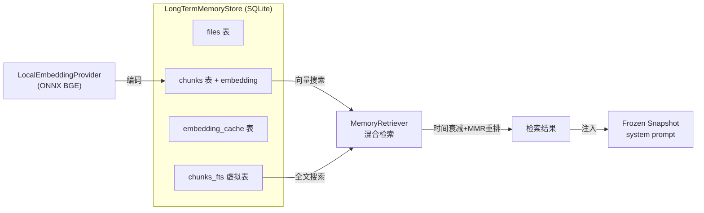

# 第 8 章：记忆 + 会话 —— Agent 怎么记住用户

> **本章目标**：讲透 OpenSquilla 的记忆和会话系统。读完本章，你会理解 SQLite+sqlite-vec+FTS5 混合检索、on-device ONNX 嵌入、frozen snapshot 注入、dream 离线整理、session_key 体系。

---

## 8.1 记忆系统架构



---

## 8.2 存储：SQLite + sqlite-vec + FTS5

```python
# 引用位置：src/opensquilla/memory/store.py:55-111
# 五张表/虚拟表：
#   files(path/source/hash/mtime/size)           — 文件元数据
#   chunks(分块文本 + embedding TEXT)             — 文本块+向量
#   embedding_cache(provider/model/hash)          — 嵌入缓存（避免重复算）
#   meta(key-value)                               — 元数据
#   chunks_fts(FTS5虚拟表)                        — 全文检索
```

**► 设计动机——为什么用 SQLite 而非专业向量库？**
- **零依赖**：SQLite 是系统自带的，桌面用户不需要装额外数据库。
- **sqlite-vec 可选**：如果系统支持 `sqlite-vec` 扩展，走向量搜索；否则退化为 FTS-only。
- **FTS5 全文检索**：SQLite 自带的全文搜索引擎，不需要额外依赖。

### 向量扩展可选（优雅降级）

```python
# 引用位置：src/opensquilla/memory/store.py:208
_probe_vec_extension()  # 检测 sqlite-vec 是否可用
_vec_available          # 标志：控制是否走向量路径
```

向量搜索不可用时退化为纯 FTS——**不失败，只降级**。

---

## 8.3 On-Device ONNX 嵌入

```python
# 引用位置：src/opensquilla/memory/embedding.py:250-479
class LocalEmbeddingProvider:
    """ONNX-only，加载 bundled 的 BGE ONNX 导出"""
    # 默认模型 BAAI/bge-small-zh-v1.5
    # 复用 squilla_router/models/v4.2_phase3_inference/bge_onnx/
    # 用 onnxruntime + HF tokenizers
    # 明确说"没有 sentence-transformers / torch 路径"
```

**► 设计动机**：
- **ONNX 而非 PyTorch**：ONNX Runtime 比 PyTorch 轻量得多，不需要安装几 GB 的 torch。
- **复用路由器的 BGE 模型**：SquillaRouter 已经 bundle 了 BGE ONNX，记忆系统直接复用——**不重复携带模型文件**。
- **CPU 执行**：`providers=["CPUExecutionProvider"]`，不需要 GPU。
- **CLS pooling**：取 CLS token 的输出作为句向量。
- **lazy load**：构造无副作用，首次编码时才加载模型。

### 编码细节

```python
# 引用位置：src/opensquilla/memory/embedding.py:444-460
_encode_onnx():
    # 批量 32，输出未归一化 float32
    # 下游自己归一化
    # truncation max_length=512
```

### 文本分块

```python
# 引用位置：src/opensquilla/memory/embedding.py:510-552
chunk_text():
    # 按"近似 token 数"切重叠块
    # CJK 算 1 token，ASCII 4 字符/token
    # 默认 400 token / 50 overlap
```

**CJK 感知**：中文字符算 1 token，ASCII 4 字符算 1 token——这是因为中文信息密度更高。

---

## 8.4 混合检索（MemoryRetriever）

```python
# 引用位置：src/opensquilla/memory/retrieval.py:184
class MemoryRetriever:
    def search(self, ...):
        # 混合检索：向量权重默认 0.7
```

### 三层后处理

1. **时间衰减**（`retrieval.py:52-69`）：`_temporal_decay`——越新的记忆权重越高。
2. **Jaccard 去重**（`retrieval.py:72`）：去除高度相似的结果。
3. **MMR 重排**（`retrieval.py:92-123`）：Maximal Marginal Relevance——平衡相关性和多样性。

**► MMR 的设计动机**：纯向量搜索可能返回多个高度相似的"近邻"结果。MMR 在"相关性"和"多样性"之间平衡——返回的结果既相关又互相补充。

---

## 8.5 Frozen Snapshot 注入

记忆怎么注入到 Agent 的 system prompt？

```python
# 引用位置：src/opensquilla/engine/runtime.py:1525-1529
@dataclass
class MemorySnapshot:
    """Frozen memory content for stable system prompt prefixes."""
    memory_md: str       # 记忆 markdown
    daily_notes: str     # 每日笔记
```

### 冻结快照（为什么？）

```python
# 引用位置：src/opensquilla/engine/runtime.py:2320
self._memory_snapshots: dict[tuple[str, str], MemorySnapshot]  # 按 (agent_id, session_key) 缓存
```

**► 设计动机**：记忆内容在**一个会话期间冻结**——不每 turn 都重新检索（省时间），保持 system prompt 稳定（利于 prefix-cache）。快照在 `warm_and_capture`（`agent_bootstrap_stage.py:391-417`）时捕获。

### 注入条件

```python
# 引用位置：src/opensquilla/session/keys.py:152-173
def allows_private_memory_prompt_injection(session_key) -> bool:
    # subagent/cron/group/channel 一律禁止注入
    # DM（私聊）允许注入
```

**安全设计**：私有记忆只在**私聊**（DM）场景注入。群聊/频道不注入——防止泄露用户私人记忆给群组成员。

---

## 8.6 Dream 离线整理

```python
# 引用位置：src/opensquilla/memory/dream/
# "离线整理记忆"子系统
# dream_factory.py / runner.py — 驱动
# curated_apply, ranking, quarantine, receipts
```

**设计动机**：日常 turn 产生的记忆是原始的、碎片化的。Dream 子系统在**空闲时**离线整理——对记忆进行排序、去重、质量筛选、隔离可疑记忆。类似于人脑睡眠时的"记忆整理"。

---

## 8.7 会话管理（Session）

### SessionManager

```python
# 引用位置：src/opensquilla/session/manager.py:188
class SessionManager:
    # get_or_create — 获取或创建会话
    # append_message — 追加消息
    # get_transcript — 获取转录
    # compact — 压缩上下文
```

### session_key —— 会话身份的核心

```python
# 引用位置：src/opensquilla/session/keys.py
# key 格式：agent:<agent_id>:<scope>

build_main_key     # agent:main:main（CLI 主会话）
build_webchat_key  # agent:main:webchat:default
build_direct_key   # DM 私聊（按 DmScope 分级）
build_group_key    # agent:<aid>:<channel>:group:<peer>
build_thread_key   # 线程（追加 :thread:<id>）
# subagent/cron 也有专门 key
```

**► session_key 的设计意义**：不同渠道、不同聊天被路由到不同 session_key，但底层是**同一个 TurnRunner**。session_key 是"会话隔离"的钥匙——决定用哪个会话历史、能否注入记忆。

### 上下文压缩（compaction）

```python
# 引用位置：src/opensquilla/session/compaction.py
# compact_context, CompactionConfig
# CompactionAndHistoryStage（turn_runner 阶段3）调用
```

当上下文超过模型限制时，压缩老消息成摘要（`SessionSummary`），保持最近消息。

### 幂等收据

```python
# 引用位置：session/models.py:305 TurnIngressReceipt
# 按 (source_scope, request_session_key, client_request_id) 去重
# 客户端重发不会重复建 turn
```

**► 设计动机**：网络抖动可能导致客户端重发同一消息。幂等收据保证"同一条消息只处理一次"。

---

## 8.8 本章小结

记忆+会话的核心设计：

1. **SQLite+sqlite-vec+FTS5**：零依赖混合检索，向量不可用时降级 FTS。
2. **On-device ONNX 嵌入**：复用路由器的 BGE 模型，无需 PyTorch。
3. **混合检索 + MMR**：向量 0.7 + FTS 0.3，时间衰减 + Jaccard 去重 + MMR 重排。
4. **Frozen snapshot 注入**：会话期间冻结记忆，稳定 prompt + 省 prefix-cache。
5. **安全注入控制**：私有记忆只在 DM 注入，群聊不注入。
6. **Dream 离线整理**：空闲时对记忆排序、去重、质量筛选。
7. **session_key 体系**：多渠道隔离的核心，决定历史/记忆/权限。
8. **幂等收据**：防重复消息。

**核心思想**：用 SQLite（零依赖）实现专业级混合检索。On-device 嵌入（复用路由器模型）避免重依赖。Frozen snapshot 平衡稳定性和实时性。安全注入控制防止隐私泄露。

**下一章**：MCP——标准协议扩展工具。
