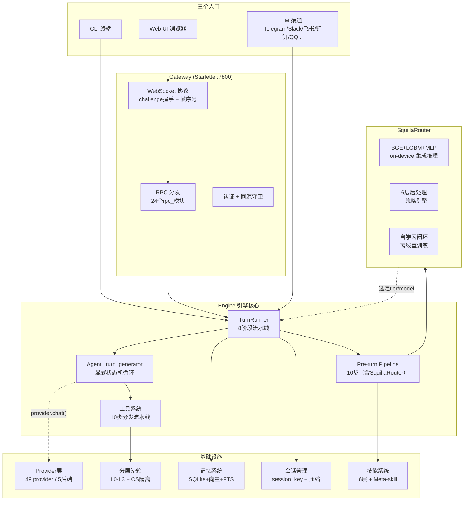

# OpenSquilla 后端 Agent 设计说明书

> **文档定位**：这是一份**教科书式的代码讲解手册**。目标不是给你一份"代码索引"，而是让你**只读这份文档、不看源码**，就能完全理解整个 Agent 的运行逻辑——每个功能点为什么这样设计、关键代码逐块在做什么、数据如何流转。
>
> 所有代码引用都标注了 `file_path:line_number`，可点击跳转到源码核对。

---

## 这份文档是写给谁的

- 想深入理解 OpenSquilla Agent 内部机制的**开发者**
- 准备做**二次开发或贡献代码**的工程师
- 不满足于"会用"，还想搞懂"为什么这么设计"的人
- 想了解 **token 高效模型路由**和**微内核 agent 架构**的人

如果你只是想快速上手使用 OpenSquilla，请先看根目录的 [README.md](../../README.md)。这份文档假设你已经能跑起项目，现在想钻进引擎盖里看个究竟。

---

## OpenSquilla 是什么

一句话：**Token-efficient, microkernel AI agent（token 高效的微内核 AI agent）**。

三个关键词拆解：
- **Token-efficient**：核心卖点。一个 on-device 模型路由器（SquillaRouter）把每个 turn 发给**最便宜的能处理的模型**——简单问题用小模型（省钱），复杂问题才用大模型（保质量）。README 声称"Same budget, more capability, better results"。
- **Microkernel（微内核）**：架构哲学。一个极小的核心（turn loop + state machine），所有功能（路由、工具、沙箱、记忆、渠道）都是可插拔的插件。
- **AI Agent**：不只是聊天机器人。它能调工具、执行代码、读写文件、记忆用户、跨渠道工作。

### 三个入口，同一个 turn loop

OpenSquilla 有三个入口：**CLI**（终端）、**Web UI**（浏览器）、**Chat Channels**（Telegram/Slack/飞书/钉钉/QQ/微信等）。关键设计：**所有入口跑同一个 turn loop**——工具分发、重试、决策日志在所有入口行为一致。

---

## 阅读路线图

```mermaid
graph LR
    A["01 架构总览<br/>微内核 + turn loop 全景"] --> B["02 Turn Loop<br/>10步流水线 + 8阶段 + 状态机"]
    B --> C["03 SquillaRouter<br/>on-device ML 路由"]
    C --> D["04 工具系统<br/>10步分发"]
    D --> E["05 沙箱<br/>L0-L3 + OS隔离"]
    E --> F["06 Subagent<br/>子Agent委派"]
    F --> G["07 Provider<br/>49 provider/5后端"]
    G --> H["08 记忆+会话<br/>向量+FTS+dream"]
    H --> I["09 MCP<br/>客户端+服务端"]
    I --> J["10 Scheduler+Recovery<br/>定时+恢复"]
    J --> K["11 Hooks+Observability<br/>钩子+可观测"]
    K --> L["12 Plugins+Contrib<br/>插件生态"]
    L --> M["13 Onboarding+Health+Eval<br/>辅助子系统"]
    M --> N["14 Gateway+渠道+技能<br/>+CLI+配置+安全"]
```



**建议第一次阅读按顺序 01 → 08**。如果你时间有限，**01 + 02 + 03 是必读的核心三章**——它们覆盖了 OpenSquilla 区别于其他 agent 框架的核心设计。

---

## 分册目录（14 章，零遗漏）

| 分册 | 内容 | 核心问题 |
|------|------|----------|
| **[01 架构总览](./01-architecture-overview.md)** | 四个第一性概念（request/turn/iteration/tool call）、微内核定位、`TurnRunner.run()` 完整逐行注解、三个上下文边界、预算四维度、与 LangGraph/AutoGen/Claude Code 对比（12 节，单轨四维交织，含 4 个 JSON 数据样例） | "OpenSquilla 的整体架构是什么？" |
| **[02 Turn Loop](./02-turn-loop.md)** | 11 步 pre-turn pipeline（fail-open 逐行讲）+ 8 阶段 TurnRunner + `_turn_generator` 切 6 片完整呈现（入口短路/历史投影/provider iteration/retry 子循环/工具并发三层锁/收尾）+ issue #305/#418/#358 深挖 | "一个 turn 从进来到出去经历了什么？" |
| **[03 SquillaRouter](./03-squilla-router.md)** | `apply_squilla_router` 切 7 片完整呈现 + V4 inference（core.predict）+ postprocess 9 步 + RoutingPolicyEngine（6 个 gate 逐个讲）+ provider mismatch 三种行为 + 自学习闭环 | "怎么把每个 turn 发给最便宜的能处理的模型？" |
| **[04 工具系统](./04-tools-system.md)** | ToolSpec 定义、10 步分发流水线、内置工具、策略链、写策略 | "Agent 怎么调用工具？怎么安全地调用？" |
| **[05 分层沙箱](./05-sandbox.md)** | L0-L3 四级安全、bwrap/seatbelt/WFP 三平台 OS 级隔离、治理批准门 | "Agent 怎么安全地执行代码和命令？" |
| **[06 Subagent 子 Agent](./06-subagent.md)** | spawn_subagent、SubagentManager/Registry、深度限制、隔离上下文、task 工具 | "复杂任务怎么分解和委派给子 Agent？" |
| **[07 Provider 层](./07-provider.md)** | LLMProvider 协议、49 provider ID、5 个后端、故障转移、集成 | "怎么对接 20+ LLM provider？" |
| **[08 记忆 + 会话](./08-memory-session.md)** | SQLite+sqlite-vec+FTS5、on-device ONNX 嵌入、frozen snapshot 注入、dream 离线整理、session_key 体系 | "Agent 怎么记住用户？怎么管理多轮上下文？" |
| **[09 MCP](./09-mcp.md)** | MCP 客户端（连外部 server 导入工具）+ MCP 服务端（把 OpenSquilla 暴露给外部 client） | "怎么通过标准协议扩展工具？" |
| **[10 Scheduler + Recovery](./10-scheduler-recovery.md)** | cron 定时任务（stagger/heartbeat/dream handler）、Desktop 恢复（原子操作/事务/锁/配置补丁） | "怎么定时执行？崩溃后怎么恢复？" |
| **[11 Hooks + Observability](./11-hooks-observability.md)** | Turn/Tool 生命周期 hook 协议、decision log、trace、replay、prompt report、redact、safety log | "怎么观测和调试 Agent 行为？" |
| **[12 Plugins + Contrib](./12-plugins-contrib.md)** | 插件注册机制、entry_points 外部插件、contrib 社区贡献工具 | "怎么扩展 OpenSquilla？社区怎么贡献工具？" |
| **[13 Onboarding + Health + Eval](./13-onboarding-health-eval.md)** | 首次启动引导向导、模型健康检查与恢复、模型评估 | "第一次用怎么配置？模型挂了怎么办？怎么评估模型？" |
| **[14 Gateway + 渠道 + 技能](./14-gateway-channels-skills.md)** | Starlette 网关、WebSocket 协议、RPC 分发、CLI/Web/IM 三入口（含 CLI 42py）、技能 6 层、Meta-skill、配置热重载、安全、Identity、Search、Chat | "HTTP/WS/CLI/渠道怎么对接？技能怎么工作？" |

---

## 阅读约定

### 代码注解格式（单轨四维交织）

前三章（01/02/03）采用统一的**单轨四维交织**结构，每个概念小节按这个顺序展开：

1. **概念铺垫**——第一次出现的术语从零讲透，不假设读者看过任何资料
2. **完整代码**——关键函数**完整贴出原始代码**（不省略、不截断、不用 `...`）；超大函数（如 `_turn_generator` 约 4600 行、`apply_squilla_router` 约 420 行）按**逻辑阶段切片**，每片完整呈现
3. **`► 注解`**——紧跟代码，逐行/逐段讲解这段代码在做什么
4. **设计动机与权衡**——不只描述"做了什么"，更要讲透"为什么这样设计、不考虑什么方案、有什么历史 bug（带 issue 编号）"
5. **真实数据样例**——配 JSON（消息变化、metadata 前后、状态流转、before/after 对比），让读者看到数据怎么流动

````
```python
# src/opensquilla/engine/types.py:42-48
class AgentState(StrEnum):
    IDLE = "idle"
    THINKING = "thinking"
    TOOL_CALLING = "tool_calling"
    STREAMING = "streaming"
    ERROR = "error"
    DONE = "done"
```

**► 注解**
- **第 42 行**：`AgentState` 是 Agent 的显式状态机……（逐字段讲）
````

### 术语

技术术语保留英文原词：turn、router、provider、sandbox、tier、session_key、pipeline、stage、middleware、checkpointer、rollout、replay 等。

### 路径约定

- 代码引用路径相对于**项目根目录** `opensquilla/`
- 核心代码在 `src/opensquilla/`
- 引擎核心在 `src/opensquilla/engine/`（`agent.py` 约 13000+ 行、`runtime.py` 约 7700+ 行——这是两个巨型文件，前三章对其中核心函数按逻辑切片完整呈现）

---

## 一张图看懂全貌



**一句话概括流程**：三个入口的消息都汇入同一个 TurnRunner → 先跑 10 步 pre-turn 流水线（SquillaRouter 在此选定最便宜的模型）→ 再跑 8 阶段 turn runner（构建 Agent → 流式执行）→ Agent 的显式状态机循环驱动 LLM↔工具交互 → 结果通过 WebSocket/RPC/渠道推回客户端。

---

## 版本与准确性说明

- 本文档基于 **OpenSquilla 0.5.0rc4**（HEAD `097db9d3`），所有 `file_path:line_number` 均为当前源码实测值
- `agent.py` 约 13000+ 行（其中 `Agent._turn_generator` 单个方法就约 4600 行，`agent.py:3758-8373`）、`runtime.py` 约 7700+ 行——这是两个巨型文件。前三章（01/02/03）已对核心函数按逻辑阶段切片**完整贴出**，不省略任何分支
- 前三章已删除旁置的 `*-source-listings.md` / `*-source.md` 文件——完整代码直接落在正文章节内，不再依赖配套文件
- 已修正的典型行号/路径错引（供对照）：`apply_model_override` 实际在 `engine/selector_override.py:178`（非 runtime.py）、`PipelineStepRecord` 实际在 `observability/decision_log.py:97`（非 pipeline.py）、`stage_router_decision` 在 `engine/steps/router_decision_record.py:190`、`FallbackPolicy` 退避字段实际叫 `base_backoff_ms`/`max_backoff_ms`（非 `retry_base_backoff_ms`）
- 代码会持续演进，若发现文档与代码不符，请以代码为准
